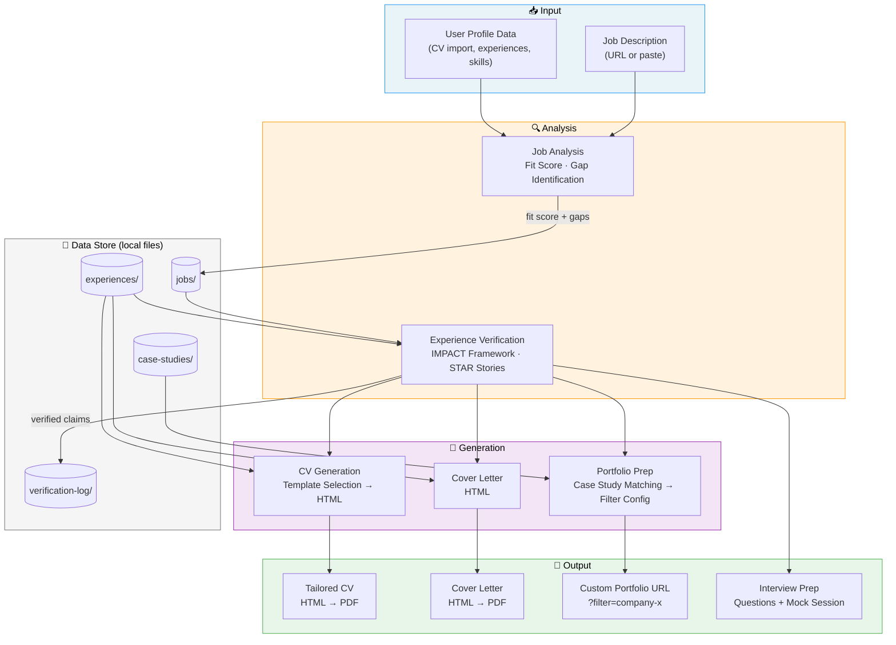

# mycareer-studio

**AI-powered career agent for design professionals.** OpenClaw skill that manages your career data, analyzes job fit, generates tailored CVs and cover letters, scaffolds a portfolio website, and prepares you for interviews — all from your terminal, all locally.

[](LICENSE)
[](https://github.com/oratioandco/mycareer-studio)

---

## The Workflow

From job description to tailored application materials in five steps:



## Quick Start

### 1. Install

Clone or install as an OpenClaw skill:

```bash
# As standalone repo
git clone https://github.com/oratioandco/mycareer-studio.git
cd mycareer-studio

# Or as OpenClaw skill (coming soon)
openclaw skill install mycareer-studio
```

### 2. Set Up

Run the setup wizard to import your career data:

```bash
mycareer setup
```

This imports your CV (PDF, text, or LinkedIn export) and creates the data structure.

### 3. Start Applying

```bash
# Analyze a job posting
mycareer analyze --url "https://company.com/jobs/senior-designer"

# Verify your experience against the job
mycareer verify --job company-senior-designer

# Generate tailored CV + cover letter
mycareer generate cv --job company-senior-designer --template modern
mycareer generate cover-letter --job company-senior-designer

# Prepare your portfolio
mycareer prepare portfolio --job company-senior-designer
```

## Commands

| Command | Description |
|---|---|
| `mycareer setup` | Import CV, set preferences, initialize data directory |
| `mycareer analyze --url <URL>` / `--paste` | Analyze job posting → fit score + gap analysis |
| `mycareer verify --job <slug>` | Verify experience with IMPACT framework |
| `mycareer generate cv --job <slug>` | Generate tailored CV (4 templates) |
| `mycareer generate cover-letter --job <slug>` | Generate matching cover letter |
| `mycareer scaffold portfolio` | Bootstrap an Astro portfolio site |
| `mycareer prepare portfolio --job <slug>` | Match case studies → filter config → custom URL |
| `mycareer add case-study` | Create portfolio case study (interactive) |
| `mycareer prep interview --job <slug>` | Interview question preparation |
| `mycareer mock-interview --job <slug>` | Practice interview simulation |
| `mycareer status` | Show career data status + active applications |

## Architecture

**No database. No cloud. No tracking.**

Everything runs locally. All data is markdown and JSON files in `data/`. Templates are HTML. Prompts are plain markdown. The Astro portfolio scaffold deploys to your own GitHub repo.

```
mycareer-studio/
├── SKILL.md              # Skill definition + documentation
├── prompts/              # AI prompt templates (9 prompts)
├── templates/
│   ├── cv/               # 4 CV templates (HTML)
│   ├── cover-letter/     # Cover letter template
│   └── portfolio/        # Astro portfolio scaffold (default theme)
├── rules/                # Writing quality gate, truthfulness, content strategy
├── schemas/              # Data schemas (experience, case study, job analysis)
├── data/                 # Your career data (gitignored)
└── outputs/              # Generated files (gitignored)
```

### Templates Are Customizable

- **CV templates**: Add your own in `templates/cv/custom/`
- **Portfolio themes**: Override individual Astro components in `templates/portfolio/custom/`
- **Quick theme**: Edit `tailwind.config.js` colors in the scaffolded portfolio

## Origin

Born from years of career strategy work and AI experimentation. The prompts, templates, IMPACT framework, and writing quality rules were refined through hundreds of real applications.

## Philosophy

- **Truthful** — Never embellishes. Every claim is verified and interview-defensible.
- **Privacy-first** — All data is local. No cloud storage, no tracking, no database.
- **Design-focused** — Built for design professionals, by a design professional.
- **Open** — MIT licensed. Fork it, adapt it, make it yours.

## License

[MIT](LICENSE) © Tobias Treppmann
